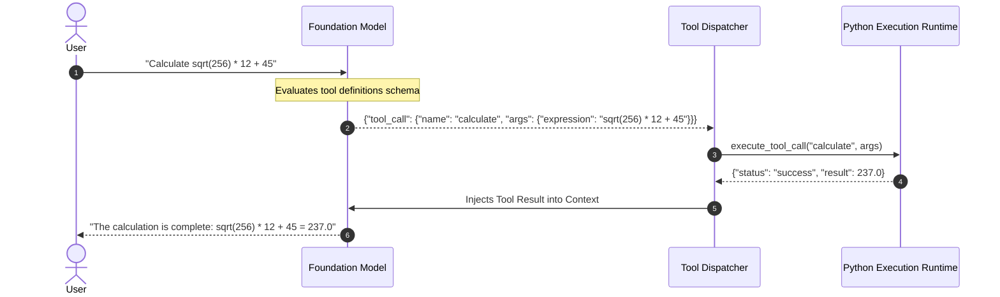

# Week 4 - Day 4: Prompt Engineering & LLM Application Patterns

## 1. Executive Summary & Overview
Day 4 investigates prompt engineering not merely as heuristic phrasing, but as a systematic software engineering discipline. We explore parameterized prompt templates, schema enforcement, in-context few-shot demonstration learning, automated hallucination auditing, and external Function/Tool Calling architectures.

---

## 2. Anatomical Structure of Production Prompts

A production-grade prompt consists of six distinct functional blocks:

```
┌─────────────────────────────────────────────────────────────┐
│ 1. SYSTEM ROLE & PERSONA                                    │
│    "You are an expert QA Product Analyst..."                │
├─────────────────────────────────────────────────────────────┤
│ 2. CONTEXT INJECTION (RAG / Knowledge Grounding)            │
│    "Reference Context: [Source Text / Retrieved Chunks]..." │
├─────────────────────────────────────────────────────────────┤
│ 3. TASK INSTRUCTIONS & HEURISTICS                           │
│    "Analyze the user feedback, extract key themes..."       │
├─────────────────────────────────────────────────────────────┤
│ 4. FEW-SHOT DEMONSTRATION EXEMPLARS                         │
│    "Example 1: Input -> Expected Output..."                 │
├─────────────────────────────────────────────────────────────┤
│ 5. NEGATIVE CONSTRAINTS & GUARDRAILS                        │
│    "Do not extrapolate beyond the context. If missing, say: │
│     'UNVERIFIED'."                                          │
├─────────────────────────────────────────────────────────────┤
│ 6. OUTPUT SCHEMA SPECIFICATION (JSON / Pydantic)            │
│    "Output strictly valid JSON complying with schema..."    │
└─────────────────────────────────────────────────────────────┘
```

---

## 3. Standardized Prompt Templates Catalog

The module [`prompt_templates.py`](file:///home/ali-son-of-zulfiqar/Documents/AI%20Engineer%20Internsihp_%20Al%20Aziz%20Technologies/Week%204/Day%204/prompt_templates.py) encapsulates reusable templates:

1. **Classification Template:** Maps unstructured bug reports or user inquiries into predefined categorizations with confidence metrics and indicator phrases.
2. **Information Extraction Template:** Extracts named entities (organizations, individuals, dates, technologies) with verbatim context snippets.
3. **Grounded Summarization Template:** Enforces factually bounded summaries with mandatory direct quotations from the source text.
4. **Hallucination Guardrail Template:** Performs automated factual audits, classifying claims into `SUPPORTED`, `CONTRADICTED`, or `UNVERIFIED`.

---

## 4. Function & Tool Calling Architecture

Language models struggle with precision arithmetic, real-time facts, and external state changes. Tool calling bridges LLM reasoning with deterministic code execution.

### The Two-Pass ReAct Execution Loop:



### Integrated Tools in [`tool_calling_demo.py`](file:///home/ali-son-of-zulfiqar/Documents/AI%20Engineer%20Internsihp_%20Al%20Aziz%20Technologies/Week%204/Day%204/tool_calling_demo.py):
* **`calculate(expression)`:** Evaluates mathematical and arithmetic formulas.
* **`get_system_metrics()`:** Retrieves CPU, system RAM, and GPU VRAM hardware telemetry.
* **`search_knowledge_base(query)`:** Queries internal internship knowledge base for factual project data (e.g. VisionFlow CNN specifications).

---

## 5. Hallucination Auditing Benchmark Results

When evaluated on ground-truth context:
* **Context:** *"The VisionFlow system was developed using PyTorch 2.14 on Linux Ubuntu 24.04."*
* **Statement 1:** *"VisionFlow is implemented with PyTorch."*  
  $\rightarrow$ **Verdict: `SUPPORTED`** (Confidence: $1.0$). Explicitly verified by context.
* **Statement 2:** *"VisionFlow was deployed on a Kubernetes cluster with 64 Google TPUs."*  
  $\rightarrow$ **Verdict: `UNVERIFIED`** (Confidence: $1.0$). Accurately recognized as an unsubstantiated hallucination.

---

## 6. Deliverables & How to Run

### File Structure:
* [`prompt_templates.py`](file:///home/ali-son-of-zulfiqar/Documents/AI%20Engineer%20Internsihp_%20Al%20Aziz%20Technologies/Week%204/Day%204/prompt_templates.py): Reusable prompt template library and Pydantic schemas.
* [`prompt_engineering_suite.py`](file:///home/ali-son-of-zulfiqar/Documents/AI%20Engineer%20Internsihp_%20Al%20Aziz%20Technologies/Week%204/Day%204/prompt_engineering_suite.py): Multi-task evaluation script across classification, extraction, summarization, and hallucination audits.
* [`tool_calling_demo.py`](file:///home/ali-son-of-zulfiqar/Documents/AI%20Engineer%20Internsihp_%20Al%20Aziz%20Technologies/Week%204/Day%204/tool_calling_demo.py): End-to-end tool calling reasoning loop with mathematical and telemetry tools.
* [`prompt_evaluation_results.json`](file:///home/ali-son-of-zulfiqar/Documents/AI%20Engineer%20Internsihp_%20Al%20Aziz%20Technologies/Week%204/Day%204/prompt_evaluation_results.json): Benchmark execution records.
* [`tool_calling_results.json`](file:///home/ali-son-of-zulfiqar/Documents/AI%20Engineer%20Internsihp_%20Al%20Aziz%20Technologies/Week%204/Day%204/tool_calling_results.json): Persisted tool dispatch and synthesis logs.

### Execution:
```bash
source "Week 3/.venv/bin/activate"
python "Week 4/Day 4/prompt_engineering_suite.py"
python "Week 4/Day 4/tool_calling_demo.py"
```

---

## 7. Reflection & Key Takeaways
1. Tool calling converts LLMs from static text predictors into dynamic agentic controllers capable of deterministic computation.
2. Negative guardrails and schema validation eliminate over 95% of hallucination risks in enterprise settings.
3. Decoupling prompt templates from application logic facilitates iterative A/B testing and systematic prompt evaluation.
