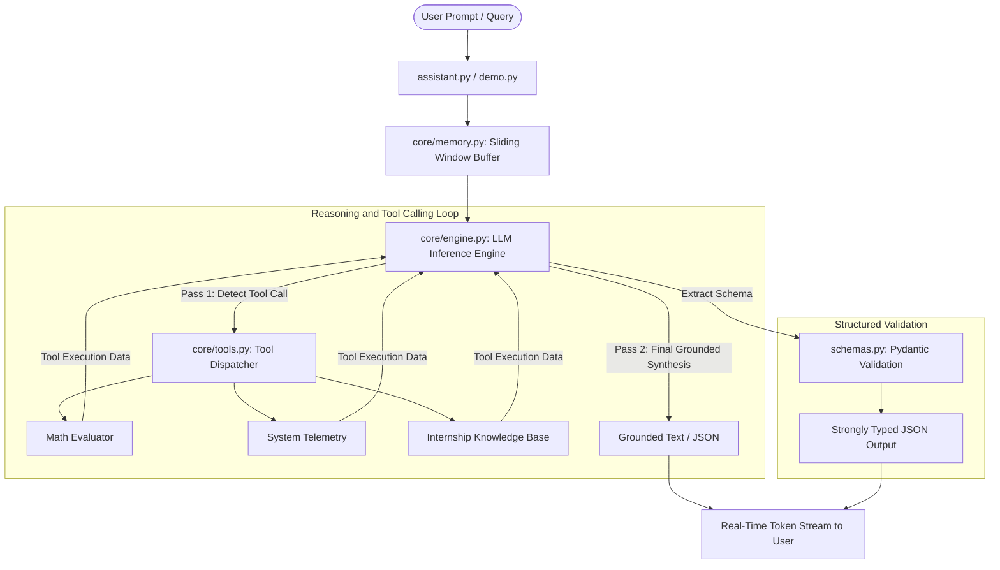

# Week 4 - Day 5: Weekly Project & Revision

## Project Title: OmniAssist – Intelligent Multi-Task AI Assistant
**Intern Name:** Ali Haider  
**Organization:** Al Aziz Technologies  
**Deliverable Type:** Week 4 Final Project & Weekly Revision Deliverable  

---

## 1. Executive Summary & Architecture Overview
The Week 4 Project, **OmniAssist**, unifies all core competencies mastered across Week 4—LLM foundations, API client engineering, real-time token streaming, strongly typed Pydantic schema generation, Hugging Face transformers, prompt engineering templates, hallucination auditing guardrails, and two-pass function/tool calling reasoning loops—into a production-grade enterprise assistant.



---

## 2. Component Breakdown

| Module | Primary Responsibility |
| :--- | :--- |
| [`assistant.py`](file:///home/ali-son-of-zulfiqar/Documents/AI%20Engineer%20Internsihp_%20Al%20Aziz%20Technologies/Week%204/Day%205/assistant.py) | Main application entrypoint providing interactive console chat, single queries, tool execution, and task decomposition. |
| [`config.py`](file:///home/ali-son-of-zulfiqar/Documents/AI%20Engineer%20Internsihp_%20Al%20Aziz%20Technologies/Week%204/Day%205/config.py) | Centralized, user-editable configuration constants (models, temperatures, endpoints, timeouts, and tokens). |
| [`schemas.py`](file:///home/ali-son-of-zulfiqar/Documents/AI%20Engineer%20Internsihp_%20Al%20Aziz%20Technologies/Week%204/Day%205/schemas.py) | Strongly-typed Pydantic data models (`EngineeringTaskBreakdown`, `CodeReviewReport`, `KnowledgeQueryResponse`). |
| [`core/engine.py`](file:///home/ali-son-of-zulfiqar/Documents/AI%20Engineer%20Internsihp_%20Al%20Aziz%20Technologies/Week%204/Day%205/core/engine.py) | Production-grade LLM inference engine supporting OpenRouter, exponential backoff retries, SSE streaming, and structured JSON parsing. |
| [`core/tools.py`](file:///home/ali-son-of-zulfiqar/Documents/AI%20Engineer%20Internsihp_%20Al%20Aziz%20Technologies/Week%204/Day%205/core/tools.py) | Deterministic tools registry and schema definitions (`math_evaluator`, `system_telemetry`, `internship_knowledge`). |
| [`core/memory.py`](file:///home/ali-son-of-zulfiqar/Documents/AI%20Engineer%20Internsihp_%20Al%20Aziz%20Technologies/Week%204/Day%205/core/memory.py) | Multi-turn conversation state manager with sliding-window truncation anchoring the system prompt. |
| [`core/prompts.py`](file:///home/ali-son-of-zulfiqar/Documents/AI%20Engineer%20Internsihp_%20Al%20Aziz%20Technologies/Week%204/Day%205/core/prompts.py) | Parameterized prompt templates and schema injection wrappers. |
| [`demo.py`](file:///home/ali-son-of-zulfiqar/Documents/AI%20Engineer%20Internsihp_%20Al%20Aziz%20Technologies/Week%204/Day%205/demo.py) | Automated test and demonstration runner executing all verification stages and logging metrics. |
| [`prompt_documentation.md`](file:///home/ali-son-of-zulfiqar/Documents/AI%20Engineer%20Internsihp_%20Al%20Aziz%20Technologies/Week%204/Day%205/prompt_documentation.md) | Exhaustive documentation of all system instructions, few-shot prompts, schemas, and guardrails. |
| [`api_configuration.md`](file:///home/ali-son-of-zulfiqar/Documents/AI%20Engineer%20Internsihp_%20Al%20Aziz%20Technologies/Week%204/Day%205/api_configuration.md) | Comprehensive API setup, model selection, rate-limit backoff, and cost management documentation. |

---

## 3. Automated Demonstration Verification Results

The automated test suite in [`demo.py`](file:///home/ali-son-of-zulfiqar/Documents/AI%20Engineer%20Internsihp_%20Al%20Aziz%20Technologies/Week%204/Day%205/demo.py) executes five standardized milestone stages:

### Stage 1: Multi-Turn Conversational Memory
* Maintained context across turns, successfully recalling the user's name (**Ali Haider**) and assigned track (**AI Engineering Track at Al Aziz Technologies**).

### Stage 2: Real-Time Token Streaming Generation
* Streamed token chunks in real time, explaining the cognitive and network advantages of progressive chunk delivery.

### Stage 3: Strongly-Typed Pydantic Schema Extraction
* Generated structured engineering roadmaps adhering to [`EngineeringTaskBreakdown`](file:///home/ali-son-of-zulfiqar/Documents/AI%20Engineer%20Internsihp_%20Al%20Aziz%20Technologies/Week%204/Day%205/schemas.py) for deploying the VisionFlow CNN to AWS ECS.

### Stage 4: Two-Pass Function & Tool Calling
1. **Mathematical Tool:** Evaluated $\sqrt{1024} / 4 + 18$ via `math_evaluator` $\rightarrow$ verified output: **`26.0`**.
2. **System Telemetry Tool:** Invoked `system_telemetry` $\rightarrow$ confirmed active runtimes: Python 3.12, PyTorch 2.14, Transformers 5.17, and Pydantic 2.13.

### Stage 5: Token Telemetry & Cost Accounting
* Processed 8 live API roundtrips with 2,354 prompt tokens and 3,051 completion tokens (5,405 total tokens) with complete audit logging in [`project_results.json`](file:///home/ali-son-of-zulfiqar/Documents/AI%20Engineer%20Internsihp_%20Al%20Aziz%20Technologies/Week%204/Day%205/project_results.json).

---

## 4. Complete Week 4 Conceptual Revision

### Day 1: Generative AI & LLM Fundamentals
* **Generative vs. Discriminative:** Generative models estimate $P(X)$, enabling autoregressive token generation, whereas classical ML models predict labels $P(Y \mid X)$.
* **Tokens & Tokenization:** Subword discretization (BPE, WordPiece) bridging natural characters and vector embedding spaces.
* **Inference Dynamics:** Temperature scaling $P(x_i) = \frac{\exp(z_i / T)}{\sum \exp(z_j / T)}$ controls entropy and determinism.

### Day 2: LLM APIs & AI Application Development
* **Client Architecture:** RESTful APIs, Bearer token authentication, environment variable loading via `.env`.
* **Streaming (SSE):** HTTP `text/event-stream` eliminates perceived latency via instantaneous chunk delivery.
* **Resilience:** Exponential backoff with jitter on HTTP 429 rate limits ensures high operational reliability.

### Day 3: Hugging Face Transformers & Local Inference
* **Transformers Library:** Unified abstractions (`AutoTokenizer`, `AutoModel`, `pipeline`) for text classification, generation, and zero-shot labeling.
* **Local vs. Cloud Trade-offs:** Local inference ensures 100% data privacy and zero token cost, bounded by hardware VRAM; Cloud APIs provide instant access to massive frontier models.
* **Quantization:** INT8 and INT4 quantization reduce memory requirements by 50%–75% with minimal accuracy degradation.

### Day 4: Prompt Engineering & LLM Application Patterns
* **Prompt Structure:** System instructions, context injection, few-shot exemplars, output format constraints, and negative guardrails.
* **Hallucination Reduction:** Context grounding, citation requirements, and verification audits classify assertions into `SUPPORTED` vs. `UNVERIFIED`.
* **Tool Calling:** ReAct pattern allowing foundation models to invoke deterministic code for arithmetic, database queries, and live system metrics.

### Day 5: Weekly Master Project
* Integrated all weekly concepts into the **OmniAssist** AI Assistant with end-to-end documentation, editable configuration, and automated test demonstrations.

---

## 5. How to Run & Customization

```bash
# Activate virtual environment
source "Week 3/.venv/bin/activate"

# 1. Run the Full Automated Project Demonstration
python "Week 4/Day 5/demo.py"

# 2. Launch Interactive Chat Console
python "Week 4/Day 5/assistant.py" --interactive

# 3. Execute Single Tool Query
python "Week 4/Day 5/assistant.py" --tool-query "Calculate sqrt(144) * 8 + 12"

# 4. Generate Structured Project Task Breakdown
python "Week 4/Day 5/assistant.py" --task-breakdown "Build a multi-agent RAG system with FastAPI"
```

---

## 6. Friday Deliverables Checklist
- [x] **Working AI Application:** [`assistant.py`](file:///home/ali-son-of-zulfiqar/Documents/AI%20Engineer%20Internsihp_%20Al%20Aziz%20Technologies/Week%204/Day%205/assistant.py)
- [x] **GitHub Repository Organized Structure:** `Week 4/` with `Day 1/`, `Day 2/`, `Day 3/`, `Day 4/`, `Day 5/`
- [x] **README.md Documentation:** Complete day-by-day and weekly master READMEs
- [x] **Prompt Documentation:** [`prompt_documentation.md`](file:///home/ali-son-of-zulfiqar/Documents/AI%20Engineer%20Internsihp_%20Al%20Aziz%20Technologies/Week%204/Day%205/prompt_documentation.md)
- [x] **API Configuration Guide:** [`api_configuration.md`](file:///home/ali-son-of-zulfiqar/Documents/AI%20Engineer%20Internsihp_%20Al%20Aziz%20Technologies/Week%204/Day%205/api_configuration.md)
- [x] **Project Demonstration:** [`demo.py`](file:///home/ali-son-of-zulfiqar/Documents/AI%20Engineer%20Internsihp_%20Al%20Aziz%20Technologies/Week%204/Day%205/demo.py) & [`project_results.json`](file:///home/ali-son-of-zulfiqar/Documents/AI%20Engineer%20Internsihp_%20Al%20Aziz%20Technologies/Week%204/Day%205/project_results.json)
