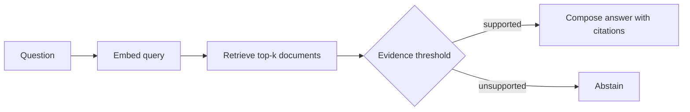

# Week 5 Day 3: Retrieval-Augmented Generation

## Objective

Ground an answer in retrieved evidence and abstain when the index cannot support the question.

## Pipeline



`rag_pipeline.py` implements this flow with deterministic documents, a similarity threshold, lexical evidence filtering, and citation identifiers.

## Run

```bash
python rag_pipeline.py
```

The demo includes both a supported question and an unsupported question. The latter must return `grounded: false`.

## Deliverable Checklist

- [x] Retrieval stage
- [x] Evidence threshold and lexical guard
- [x] Citation-bearing answer
- [x] Unsupported-query abstention
