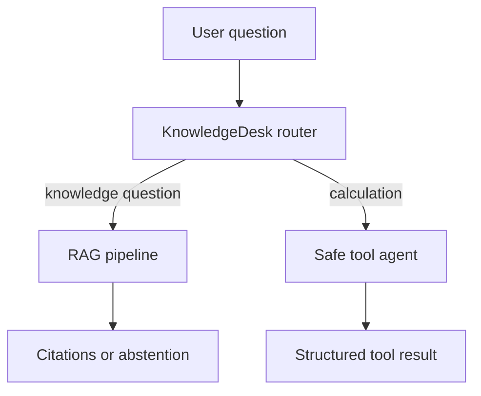

# Week 5 Day 5: KnowledgeDesk Integration Project

## Project Summary

KnowledgeDesk is an offline-first assistant that combines semantic retrieval, grounded answers, citations, abstention, and safe tool use. It is the Week 5 integration checkpoint and the knowledge layer reused by Week 6.

## Run

```bash
python knowledge_desk.py
```

## Expected Behaviors

- Questions about indexed internship material return an answer with citation IDs.
- Arithmetic requests use the registered calculator tool.
- Unsupported questions explicitly report that evidence is unavailable.

## Architecture



## Deliverable Checklist

- [x] Integrated RAG pipeline
- [x] Integrated tool agent
- [x] Offline demonstration
- [x] Clear grounded and unsupported response states
