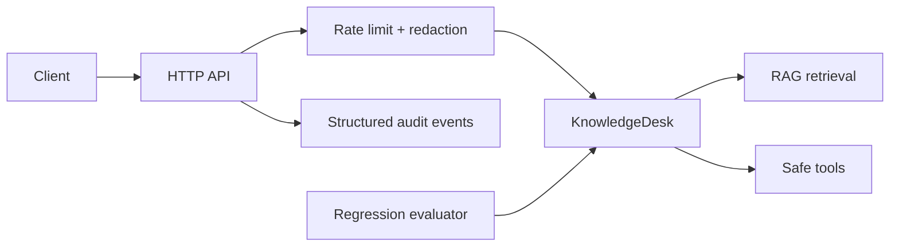

# Week 6: Advanced AI Engineering & Master Project

Week 6 hardens KnowledgeDesk into a production-shaped AI service. The work covers evaluation, API boundaries, observability, security, deployment, and a final reproducible project report.

## Learning Path

| Day | Focus | Deliverable |
|---|---|---|
| 1 | Evaluation and regression testing | `Day 1/evaluation.py` |
| 2 | HTTP API engineering | `Day 2/service.py` |
| 3 | Reliability, security, and observability | `Day 3/production.py` |
| 4 | Packaging and deployment | `Day 4/Dockerfile`, `Day 4/deployment.md` |
| 5 | Master project integration | `Day 5/master_project.py` |

## Architecture



## Run

```bash
python "Week 6/Day 1/evaluation.py"
python "Week 6/Day 2/service.py" --demo
python "Week 6/Day 3/production.py"
python "Week 6/Day 5/master_project.py"
```

The examples are offline and require Python 3.10 or newer. Day 2 optionally exposes the same handler through FastAPI in production; the included standard-library server keeps the learning project runnable without package installation.

## Final Deliverables

- [x] Golden test cases and measurable evaluation report
- [x] JSON HTTP API with health and query endpoints
- [x] Input redaction, rate limiting, request IDs, and audit events
- [x] Container and deployment runbook
- [x] Master project report and end-to-end smoke test
